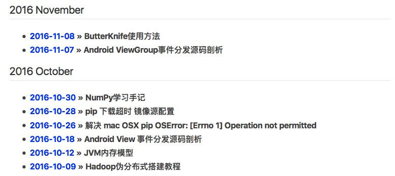

# Jekyll_Templet

本Jekyll主题来自[Hux Blog](https://github.com/Huxpro/huxpro.github.io)(Powered by Jekyll with Hux Theme )，使用方法也可以参考其中的README.md。

本人对该Jekyll做了修改，并增加新功能。

本人博客 [phantomVK](https://github.com/phantomvk)
使用模板 [Jekyll_Templet](https://github.com/phantomVK/Jekyll_Templet)

## 使用方法

### Fork or Clone

把工程Fork的自己的Github库中或Clone到本地

```bash
$ git clone https://github.com/phantomVK/phantomvk.github.io.git
```

然后把项目文件夹名字修改为形如`GithubUsername.github.io`即可。

### 修改配置参数

打开配置文件`_config.yml`，按照以下示例把`Jekyll_Templet`改为自己的`Github用户名`。

```
# Site settings
title: Jekyll_Templet
SEOTitle: Jekyll_Templet
header-img: img/home.jpg
email: Jekyll_Templet@gmail.com
description: ""
keyword: ""
#url: "http://"       # your host, for absolute URL
#baseurl: "/"         # for example, '/blog' if your blog hosted on 'host/blog'
```

### 文章编写

在`_draft`文件夹中有文章的模板`2016-10-01-demo.markdown`。

```
---
layout:     post
title:      ""
subtitle:   ""
date:       2016-10-01
author:     "Jekyll_Templet"
header-img: "img/main_img.jpg"
catalog:    true
tags:
    - tags
---
```

### 侧边栏

#### 头像和描述

用于配置是否打开侧边栏，自我描述和头像。

```
# Sidebar settings
sidebar: true                        # whether or not using Sidebar.
sidebar-about-description: ""
sidebar-avatar: /img/avatar.jpg      # use absolute URL, seeing it's used in both `/` and `/about/`
```


#### 打赏二维码

我在侧边栏添加了支付打赏功能，这里设置支付二维码的图片路径。图片分辨率建议`275*275`，格式为`jpg`。

```
sidebar-wechat-pay: /img/wechat.jpg
sidebar-alipay-pay: /img/alipay.jpg
```

设置是否打开侧边栏打赏二维码，并可以单独打开微信支付、支付宝支付。

```
# Pay Tags
pay-tags: false   # false为关闭，true为打开
pay-tags-wechat: false
pay-tags-alipay: false
```


#### 友情链接

好友功能，全部注释就会自动关闭。

```
# Friends
friends: [
    {
        title: "Foo Blog",
        href: "http://foo.github.io/"
    },
    {
        title: "Bar Blog",
        href: "http://bar.github.io"
    }
]
```


#### 自己链接

设置链接，仅需输入对应用户名，会自动链接。

```
# SNS settings
RSS: false
#zhihu_username: username
#github_username:
#weibo_username:     
#twitter_username:   
#facebook_username:  
#linkedin_username:  firstname-lastname-idxxxx
```

### 文章归档

我增加了文章归档功能，自动按照月份归档文章。具体展示请参考[phantomVK - Archive](https://phantomvk.github.io/archive/)



### 评论框

到多说网站注册账号，并把多说用户名填写到`duoshuo_username`。

```
# Duoshuo settings
# Share component is depend on Comment so we can NOT use share only.
duoshuo_username: 
# duoshuo_share：set to false if you want to use Comment without Sharing
duoshuo_share: true
```

# License

    MIT License Copyright (c) 2013-2016 Blackrock Digital LLC.
    
    Apache License 2.0 Copyright(c) 2015-2016 Huxpro  
      
    Apache License 2.0 Copyright(c) 2016 phantomVK
    
    

