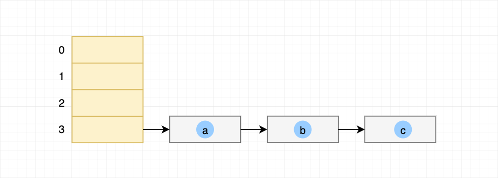
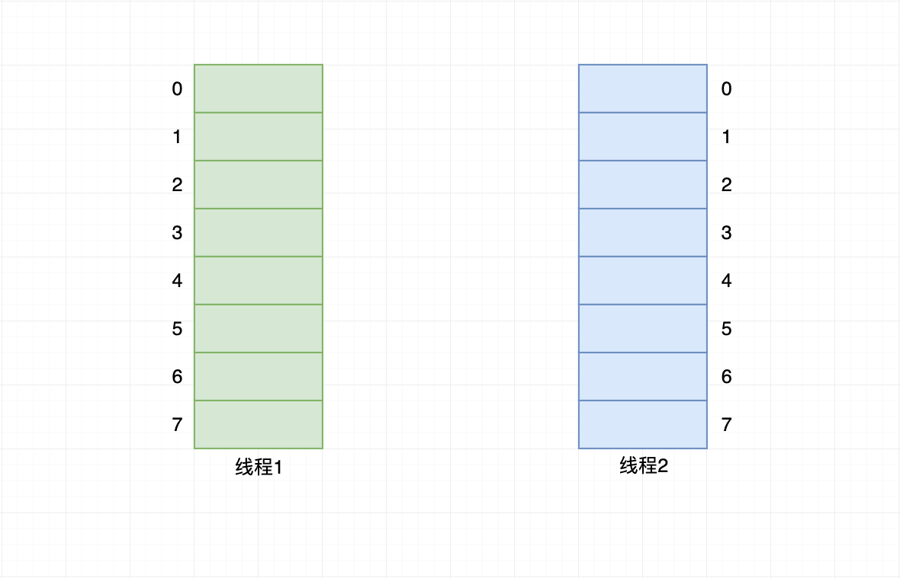
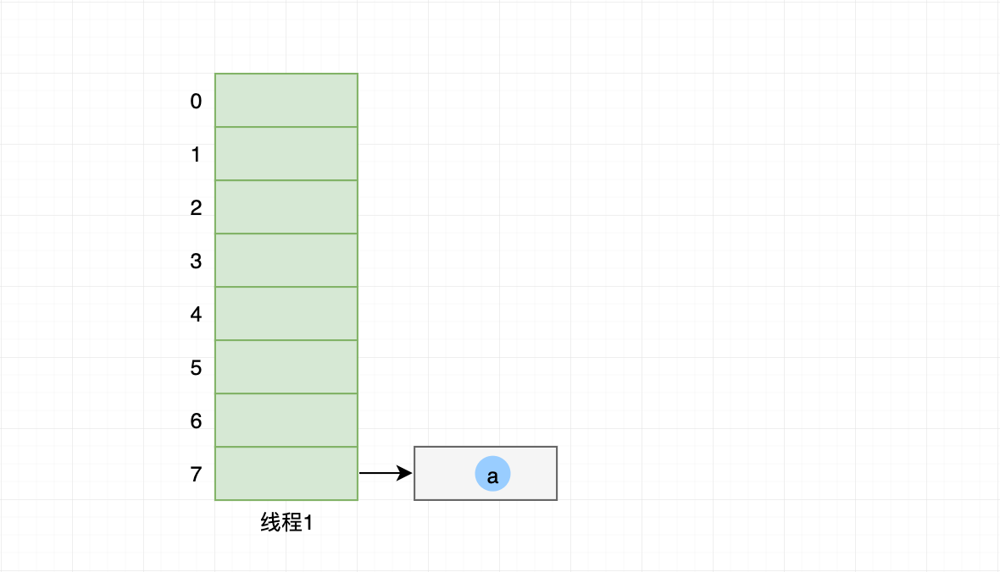
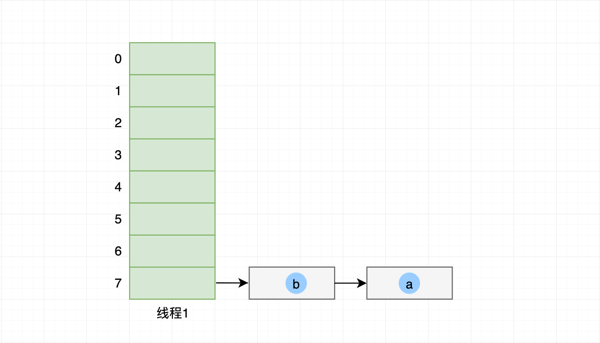
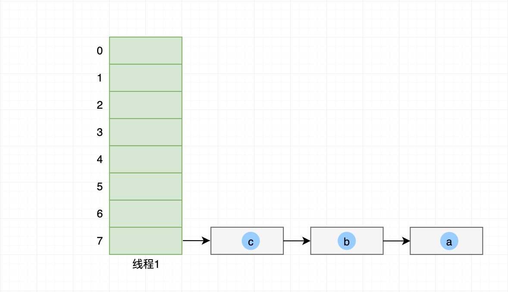
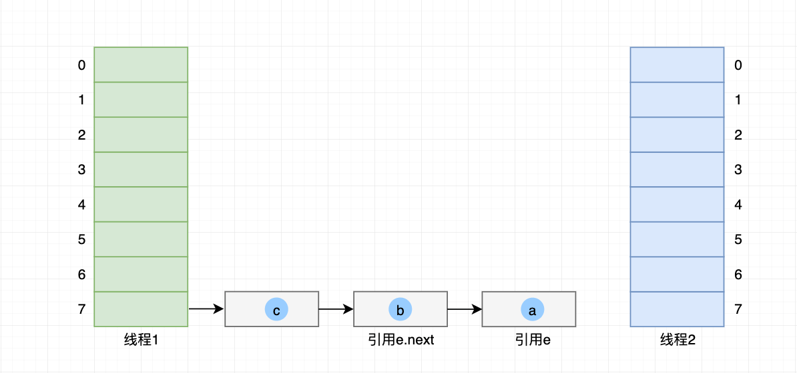
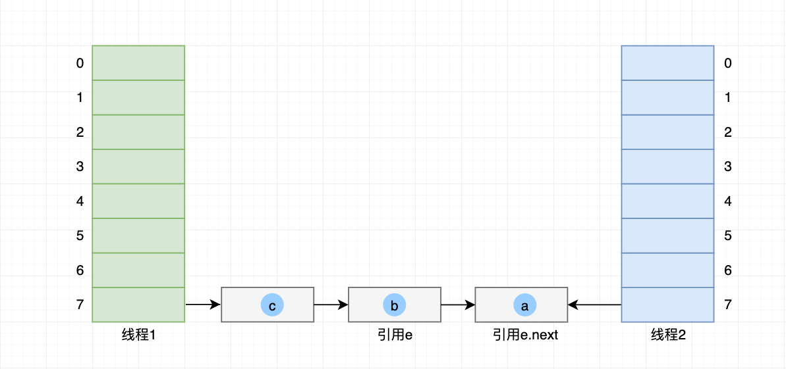
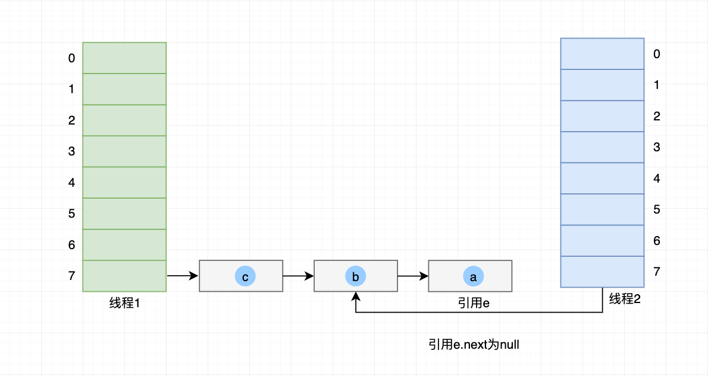
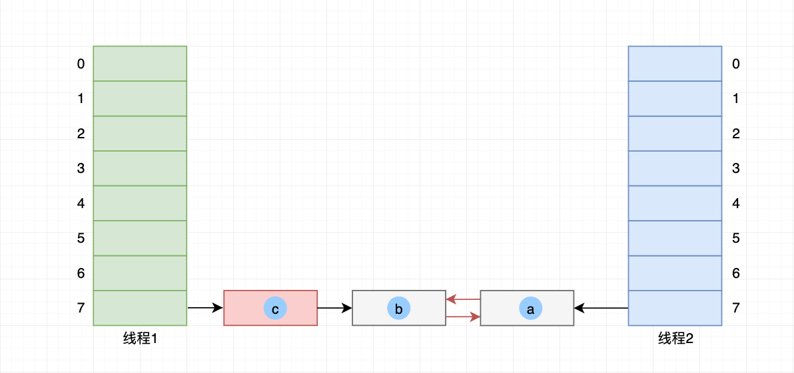

---


layout:     post
title:      "HashMap死循环原理"
date:       2019-01-01
author:     "phantomVK"
header-img: "img/bg/post_bg.jpg"
catalog:    false
tags:
    - Java
---

```java
public V put(K key, V value) {
    if (key == null)
        return putForNullKey(value);
    // 获取键的哈希值
    int hash = hash(key.hashCode());
    // 计算键哈希值对应桶
    int i = indexFor(hash, table.length);
    for (Entry<K,V> e = table[i]; e != null; e = e.next) {
        Object k;
        // 如果该键对应值已存在，则替换并返回旧值
        if (e.hash == hash && ((k = e.key) == key || key.equals(k))) {
            V oldValue = e.value;
            e.value = value;
            e.recordAccess(this);
            return oldValue;
        }
    }

    modCount++;
    // 键不存在，创建新的节点
    addEntry(hash, key, value, i);
    return null;
}
```

创建新的节点，从源码可知是链表的头插法

```java
void addEntry(int hash, K key, V value, int bucketIndex) {
    // 获取已有链表头节点
    Entry<K,V> e = table[bucketIndex];
    // 创建新节点，并把上述链表头结点作为后续元素
    // 然后自己作为该哈希桶得头节点
    table[bucketIndex] = new Entry<>(hash, key, value, e);
    // 由于元素数量超过阈值，所以触发扩容
    if (size++ >= threshold)
        resize(2 * table.length);
}
```

开始扩容

```java
void resize(int newCapacity) {
    Entry[] oldTable = table;
    int oldCapacity = oldTable.length;
    if (oldCapacity == MAXIMUM_CAPACITY) {
        threshold = Integer.MAX_VALUE;
        return;
    }

    Entry[] newTable = new Entry[newCapacity];
    // 迁移旧哈希桶的元素到新哈希桶内
    transfer(newTable);
    // 新哈希桶替换旧桶
    table = newTable;
    threshold = (int)(newCapacity * loadFactor);
}
```

迁移元素

```java
void transfer(Entry[] newTable) {
    Entry[] src = table;
    int newCapacity = newTable.length;
    for (int j = 0; j < src.length; j++) {
        Entry<K,V> e = src[j];
        if (e != null) {
            src[j] = null;
            do {
                Entry<K,V> next = e.next;
                int i = indexFor(e.hash, newCapacity);
                e.next = newTable[i];
                newTable[i] = e;
                e = next;
            } while (e != null);
        }
    }
}
```

假设桶数量为4，负载因子为0.75，扩容阈值为3。元素a插入哈希表之后，达到了扩容阈值触发扩容操作。



假设有2个线程在写入哈希表，当达到阈值后，两个线程分别开始扩容操作，并各自创建新的哈希桶。



首先线程2的哈希桶迁移元素执行到以下位置，然后处理器时间片用完被暂停，然后切换到线程1。

```java
void transfer(Entry[] newTable) {
    Entry[] src = table;
    int newCapacity = newTable.length;
    for (int j = 0; j < src.length; j++) {
        Entry<K,V> e = src[j];
        if (e != null) {
            src[j] = null;
            do {
                Entry<K,V> next = e.next;
                // 线程2首次进入循环且上述代码已执行完成，暂停在此位置
                int i = indexFor(e.hash, newCapacity);
                e.next = newTable[i];
                newTable[i] = e;
                e = next;
            } while (e != null);
        }
    }
}
```

线程1也开始以上操作，并把旧哈希桶的元素a通过头插法，插入到线程1自己创建的新哈希桶内：



线程1迁移元素b到自己的哈希桶内：



线程1迁移元素c到自己的哈希桶内，由于是头插法，所以哈希桶索引7链表顺序为 `c->b->a`。



这个时候，线程1的处理器时间片也用完了，停在以下代码：

```java
void resize(int newCapacity) {
    Entry[] oldTable = table;
    int oldCapacity = oldTable.length;
    if (oldCapacity == MAXIMUM_CAPACITY) {
        threshold = Integer.MAX_VALUE;
        return;
    }

    Entry[] newTable = new Entry[newCapacity];
    // 线程1一把所有元素迁移到自己创建的新哈希桶内
    transfer(newTable);
    // 但是时间片耗尽，上述代码执行完毕暂停在这里
    // 还没把新哈希桶替换旧哈希桶
    table = newTable;
    threshold = (int)(newCapacity * loadFactor);
}
```

然后线程2的操作开始恢复。从上文可知对线程2来说，不知道线程1已经改变以下3个元素的链表顺序，只知道引用e依然指向元素a，e.next指向元素b，如下图文字所示：



然后恢复 __void transfer(Entry[] newTable)__ 的操作

- 把引用e所指定的元素a头插法放入自己新建的哈希桶内，

- 然后引用e改为指引元素a的下一个链表节点，即元素b
- 同理e.next从指向元素b，根据元素b的next，改为指向元素a



完成上述操作后，元素b也通过头插法插入到哈希桶7。顺序变成：__哈希桶7->元素b->元素a__



引用e继续移动，指向元素a。因为元素a的next为null，所以e.next也为null。同样元素a头插法插入到哈希桶7，在上一个步骤，我们知道顺序是 __哈希桶7->元素b->元素a__，执行完这个步骤后，顺序变为 __哈希桶7->元素a->元素b__ 。相当于元素a被两次头插法插入到哈希桶7。并且，在此期间，元素b和元素a的引用互相指引。



如果线程1先把新哈希桶替换就哈希桶，后续线程2又覆盖了线程1的同替换操作，那么元素c将永远不会得到访问。当然，无论是哪个线程最后完成旧哈希桶替换，只要执行 __get(Key)__ 操作，只要同命中到哈希桶7，都会发生死循环。


