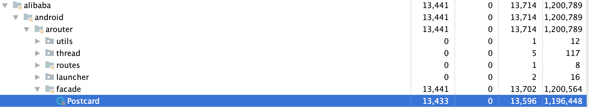

Proguard

- [zipalign](https://developer.android.com/studio/command-line/zipalign.html?hl=zh-cn)


#### ARouter


```java
class RoomSummaryComparator : Comparator<RoomSummary> {
    override fun compare(lSummary: RoomSummary?, rSummary: RoomSummary?): Int {
        return when {
            lSummary == null && rSummary == null -> 0
            lSummary == null -> 1
            rSummary == null -> -1
            else -> {
                val lEvent = lSummary.latestReceivedEvent
                val rEvent = rSummary.latestReceivedEvent
                when {
                    lEvent == null && rEvent == null -> 0
                    lEvent == null -> 1
                    rEvent == null -> -1
                    else -> {
                        // 每次对比都ARouter获取新的对象SessionManager
                        val lTs = ServiceFactory.getInstance().sessionManager
                                .defaultLatestChatMessageCache
                                .getLatestTextTs(applicationContext, lSummary.roomId)
                                ?: lEvent.getOriginServerTs()

                        // 每次对比都ARouter获取新的对象SessionManager
                        val rTs = ServiceFactory.getInstance().sessionManager
                                .defaultLatestChatMessageCache
                                .getLatestTextTs(applicationContext, rSummary.roomId)
                                ?: rEvent.getOriginServerTs()

                        val delta = lTs - rTs
                        when {
                            delta < 0 -> 1
                            delta > 0 -> -1
                            else -> 0
                        }
                    }
                }
            }
        }
    }
}
```

根据 __ARouter__ 的实现，每次经过 __ARouter__ 的实现获取服务的对象引用，

```kotlin
class RoomSummaryComparator : Comparator<RoomSummary> {

    private val messageCache = ServiceFactory.getInstance()
            .sessionManager
            .defaultLatestChatMessageCache
      
    override fun compare(lSummary: RoomSummary?, rSummary: RoomSummary?): Int {
        ....
    }
}
```

#### 堆栈跟踪开销

```kotlin
val flag = try {
    event.getContent().asJsonObject.get("flag").asInt
} catch (e: Exception) {
    null
}
```

多次抛出 __StackTraceElement__。每个32B抛出1041次，__ShallowSize__ 总计：33,312B，考虑到 __StackTraceElement__ 里面用于保存堆栈信息的的字符串变量，实际占用将远大于 33,312B。

```kotlin
if (event.getContent().asJsonObject.has("flag")) {
    event.getContent().asJsonObject.get("flag").asInt
} else {
    null
}
```

#### 重用Rect

下面方法 __onDraw()__ 和 __onResize()__ ，按照仅执行一次的条件，需要创建9个 __RectF__ 对象。

```kotlin
class BubbleShape @JvmOverloads constructor(context: Context,
                                            var arrowPosition: ArrowDirection = ArrowDirection.LEFT,
                                            var solidColor: Int = Color.WHITE,
                                            var strokeColor: Int = 0xFFCFCFCF.toInt(),
                                            var strokeWidth: Int = context.dip(1)) : Shape() {

    enum class ArrowDirection {
        LEFT, RIGHT
    }

    var arrowWidth: Float = context.dip(6).toFloat()
    var arrowHeight: Float = context.dip(12).toFloat()
    var arrowMarginTop: Float = context.dip(14).toFloat()
    var cornerRadius: Float = context.dip(10).toFloat()
    private val mTop = Path()
    private val mBottom = Path()

    override fun draw(canvas: Canvas, paint: Paint) {
        paint.color = solidColor
        paint.style = Paint.Style.FILL
        paint.isAntiAlias = true
        paint.isDither = true
        val isLeft = arrowPosition == ArrowDirection.LEFT

        canvas.save()
        if (!isLeft) {
            canvas.scale(-1f, 1f, width / 2, height / 2)
        }

        canvas.drawPath(mTop, paint)
        canvas.drawRect(RectF(arrowWidth, arrowMarginTop + arrowHeight, width, height - cornerRadius), paint)
        canvas.drawPath(mBottom, paint)

        paint.color = strokeColor
        paint.style = Paint.Style.STROKE
        paint.strokeCap = Paint.Cap.ROUND
        paint.strokeJoin = Paint.Join.ROUND
        paint.strokeWidth = strokeWidth.toFloat()
        val offset = strokeWidth / 2f
        val ext = cornerRadius * 0.5f

        canvas.drawArc(RectF(arrowWidth, offset, (arrowWidth + cornerRadius), cornerRadius + offset),
                180f, 90f, false, paint)
        canvas.drawLine(arrowWidth + cornerRadius - ext, offset,
                width - cornerRadius + ext, offset, paint)
        canvas.drawArc(RectF((width - cornerRadius - offset), offset, width - offset, cornerRadius + offset), 270f,
                90f, false, paint)
        canvas.drawLine(width - offset, cornerRadius - ext, width - offset, height - cornerRadius + ext, paint)
        canvas.drawArc(RectF(width - cornerRadius - offset, height - cornerRadius - offset, width - offset, height - offset),
                0f, 90f, false, paint)
        canvas.drawLine(width - cornerRadius + ext, height - offset,
                arrowWidth + cornerRadius - ext, height - offset, paint)
        canvas.drawArc(RectF(arrowWidth, (height - cornerRadius - offset), (arrowWidth + cornerRadius), height - offset),
                90f, 90f, false, paint)
        canvas.drawLine(arrowWidth, height - cornerRadius + ext, arrowWidth, arrowMarginTop + arrowHeight, paint)
        canvas.drawLine(arrowWidth, arrowMarginTop + arrowHeight, 0f, arrowMarginTop + arrowHeight / 2, paint)
        canvas.drawLine(0f, arrowMarginTop + arrowHeight / 2, arrowWidth, arrowMarginTop, paint)
        canvas.drawLine(arrowWidth, arrowMarginTop, arrowWidth, cornerRadius - ext, paint)
        canvas.restore()
    }

    override fun onResize(width: Float, height: Float) {
        mTop.reset()
        mTop.moveTo(arrowWidth, (arrowMarginTop + arrowHeight))
        mTop.lineTo(0f, (arrowMarginTop + arrowHeight / 2))
        mTop.lineTo(arrowWidth, arrowMarginTop)
        mTop.lineTo(arrowWidth, cornerRadius)
        mTop.arcTo(RectF(arrowWidth, 0f, (arrowWidth + cornerRadius), cornerRadius),
                180f, 90f)
        mTop.lineTo((width - cornerRadius), 0f)
        mTop.arcTo(RectF((width - cornerRadius), 0f, width, cornerRadius), 270f, 90f)
        mTop.lineTo(width, (arrowHeight + arrowMarginTop))

        mBottom.reset()
        mBottom.moveTo(width, (height - cornerRadius))
        mBottom.arcTo(RectF((width - cornerRadius), (height - cornerRadius), width, height), 0f, 90f)
        mBottom.lineTo((arrowWidth + cornerRadius), height)
        mBottom.arcTo(RectF(arrowWidth, (height - cornerRadius), (arrowWidth + cornerRadius), height),
                90f, 90f)
        mBottom.lineTo(arrowWidth, height - cornerRadius)

    }
}
```

下面修改为复用 RectF的变量，在需要使用是，先调用 RectF.set(left, top, right, button) 设置新值，然后把该RectF提供给绘制方法。

如果可以确保 __BubbleShape__ 只在主线程执行，则完全把 __RectF__ 设置为常量。这样无论多少个 __BubbleShape__ 实例，最终只会复用唯一一个 __RectF__。

```kotlin
class BubbleShape @JvmOverloads constructor(context: Context,
                                            var arrowPosition: ArrowDirection = ArrowDirection.LEFT,
                                            var solidColor: Int = Color.WHITE,
                                            var strokeColor: Int = 0xFFCFCFCF.toInt(),
                                            var strokeWidth: Int = context.dip(1)) : Shape() {

    enum class ArrowDirection {
        LEFT, RIGHT
    }

    var arrowWidth: Float = context.dip(6).toFloat()
    var arrowHeight: Float = context.dip(12).toFloat()
    var arrowMarginTop: Float = context.dip(14).toFloat()
    var cornerRadius: Float = context.dip(10).toFloat()
    private val mTop = Path()
    private val mBottom = Path()

    private val rect = RectF()

    override fun draw(canvas: Canvas, paint: Paint) {
        paint.color = solidColor
        paint.style = Paint.Style.FILL
        paint.isAntiAlias = true
        paint.isDither = true
        val isLeft = arrowPosition == ArrowDirection.LEFT

        canvas.save()
        if (!isLeft) {
            canvas.scale(-1f, 1f, width / 2, height / 2)
        }

        canvas.drawPath(mTop, paint)
        rect.set(arrowWidth, arrowMarginTop + arrowHeight, width, height - cornerRadius)
        canvas.drawRect(rect, paint)
        canvas.drawPath(mBottom, paint)

        paint.color = strokeColor
        paint.style = Paint.Style.STROKE
        paint.strokeCap = Paint.Cap.ROUND
        paint.strokeJoin = Paint.Join.ROUND
        paint.strokeWidth = strokeWidth.toFloat()
        val offset = strokeWidth / 2f
        val ext = cornerRadius * 0.5f

        rect.set(arrowWidth, offset, (arrowWidth + cornerRadius), cornerRadius + offset)
        canvas.drawArc(rect, 180f, 90f, false, paint)
        canvas.drawLine(arrowWidth + cornerRadius - ext, offset,
                width - cornerRadius + ext, offset, paint)
        rect.set((width - cornerRadius - offset), offset, width - offset, cornerRadius + offset)
        canvas.drawArc(rect, 270f, 90f, false, paint)
        canvas.drawLine(width - offset, cornerRadius - ext, width - offset, height - cornerRadius + ext, paint)

        rect.set(width - cornerRadius - offset, height - cornerRadius - offset, width - offset, height - offset)
        canvas.drawArc(rect, 0f, 90f, false, paint)
        canvas.drawLine(width - cornerRadius + ext, height - offset,
                arrowWidth + cornerRadius - ext, height - offset, paint)
        rect.set(arrowWidth, (height - cornerRadius - offset), (arrowWidth + cornerRadius), height - offset)
        canvas.drawArc(rect, 90f, 90f, false, paint)
        canvas.drawLine(arrowWidth, height - cornerRadius + ext, arrowWidth, arrowMarginTop + arrowHeight, paint)
        canvas.drawLine(arrowWidth, arrowMarginTop + arrowHeight, 0f, arrowMarginTop + arrowHeight / 2, paint)
        canvas.drawLine(0f, arrowMarginTop + arrowHeight / 2, arrowWidth, arrowMarginTop, paint)
        canvas.drawLine(arrowWidth, arrowMarginTop, arrowWidth, cornerRadius - ext, paint)
        canvas.restore()
    }

    override fun onResize(width: Float, height: Float) {
        mTop.reset()
        mTop.moveTo(arrowWidth, (arrowMarginTop + arrowHeight))
        mTop.lineTo(0f, (arrowMarginTop + arrowHeight / 2))
        mTop.lineTo(arrowWidth, arrowMarginTop)
        mTop.lineTo(arrowWidth, cornerRadius)

        rect.set(arrowWidth, 0f, (arrowWidth + cornerRadius), cornerRadius)
        mTop.arcTo(rect, 180f, 90f)
        mTop.lineTo((width - cornerRadius), 0f)

        rect.set((width - cornerRadius), 0f, width, cornerRadius)
        mTop.arcTo(rect, 270f, 90f)
        mTop.lineTo(width, (arrowHeight + arrowMarginTop))

        mBottom.reset()
        mBottom.moveTo(width, (height - cornerRadius))

        rect.set((width - cornerRadius), (height - cornerRadius), width, height)
        mBottom.arcTo(rect, 0f, 90f)
        mBottom.lineTo((arrowWidth + cornerRadius), height)

        rect.set(arrowWidth, (height - cornerRadius), (arrowWidth + cornerRadius), height)
        mBottom.arcTo(rect, 90f, 90f)
        mBottom.lineTo(arrowWidth, height - cornerRadius)
    }
}
```

#### 重复创建

```kotlin
class MessagesListAdapter(mContext: Context,
                          private val mSession: Session,
                          private val mRoom: Room,
                          private val mMediasCache: MediasCache) : RecyclerView.Adapter<ViewHolder>() {

    private val messageRows = ArrayList<MessageRow>()
    private val headerMessageRows = ArrayList<MessageRow>()
    private val footerMessageRows = ArrayList<MessageRow>()

    override fun onBindViewHolder(holder: ViewHolder, position: Int) {
        holders.bind(holder, allRows()[position])
    }

    override fun getPosition(messageRow: MessageRow?): Int {
        return allRows().indexOf(messageRow)
    }

    override fun getItemCount(): Int {
        return headerMessageRows.size + messageRows.size + footerMessageRows.size
    }

    override fun getItem(position: Int): MessageRow {
        return when (position) {
            in 0 until headerMessageRows.size -> {
                headerMessageRows[position]
            }

            in headerMessageRows.size until headerMessageRows.size + messageRows.size -> {
                messageRows[position - headerMessageRows.size]
            }

            else -> {
                footerMessageRows[position - headerMessageRows.size - messageRows.size]
            }
        }
    }

    private fun allRows(): ArrayList<MessageRow> {
      val rows = ArrayList<MessageRow>()
      rows.addAll(headerMessageRows)
      rows.addAll(messageRows)
      rows.addAll(footerMessageRows)
      return rows
    }
}
```

重复在主线程解析 __Json__ 导致性能开销

```java
class RoomTopic(private val topicString: String?) {

    // 转换字符串变量topicString为JsonObject
    private var topicJson = try {
        val element = JsonParser().parse(topicString)
        if (element.isJsonObject) {
            element.asJsonObject!!
        } else {
            JsonObject().apply {
                addProperty(JSON_KEY_TOPIC, topicString)
            }
        }
    } catch (e: Exception) {
        JsonObject().apply {
            addProperty(JSON_KEY_TOPIC, topicString)
        }
    }

    // 房间属性
    var topic by jsonProperty<String>(JSON_KEY_TOPIC)

    // 是否单聊
    var isDirect by jsonProperty<Boolean>(JSON_KEY_IS_DIRECT)

    // 是否发送enterRoom
    var isSendEnterRoom by jsonProperty<Boolean>(JSON_KEY_IS_SEND_ENTER_ROOM)

    // 是否开启水印
    var isWaterMark by jsonProperty<Boolean>(JSON_KEY_IS_WATER_MARK)
  
    fun getElement(key: String): JsonElement? = topicJson[key]

    operator fun <reified T> get(key: String): T? {
        return gson.fromJson(getElement(key), object : TypeToken<T>() {}.type)
    }

    operator fun <V> set(key: String, value: V) {
        topicJson.add(key, gson.toJsonTree(value))
    }

    private inline fun <reified T> jsonProperty(key: String): ReadWriteProperty<Any, T?> {
        return object : ReadWriteProperty<Any, T?> {
            override fun getValue(thisRef: Any, property: KProperty<*>): T? = get<T>(key)

            override fun setValue(thisRef: Any, property: KProperty<*>, value: T?) =
                    set(key, value)
        }
    }
}
```

#### 重复创建实例 

按照测试时账号有307个Room实例计算，每个gson实例的引用占用4B(4B是32位，64为是8B)，实例本身占用654B，一次优化剩下197K的内存。

```java
public class Room {
    private final Gson gson = new GsonBuilder().create();
}
```

```java
public class Room {
    private static final Gson gson = new GsonBuilder().create();
}
```

#### try resource

```kotlin
try {
    BitmapFactory.decodeStream(FileInputStream(file), null, opts)
} catch (e: OutOfMemoryError) {
    e.printStackTrace()
    System.gc()
}
```

```java
try {
    FileInputStream(file).use {
        BitmapFactory.decodeStream(it, null, opts)
    }
} catch (e: OutOfMemoryError) {
    e.printStackTrace()
    System.gc()
}
```

### #

```
com.finogeeks.finochatapp D/StrictMode: StrictMode policy violation; ~duration=123 ms: android.os.strictmode.DiskReadViolation
        at android.os.StrictMode$AndroidBlockGuardPolicy.onReadFromDisk(StrictMode.java:1504)
        at java.io.UnixFileSystem.checkAccess(UnixFileSystem.java:251)
        at java.io.File.exists(File.java:815)
        at org.matrix.androidsdk.db.MXMediasCache.getFolderFile(MXMediasCache.java:202)
        at org.matrix.androidsdk.db.MXMediasCache.mediaCacheFile(MXMediasCache.java:473)
        at org.matrix.androidsdk.db.MXMediasCache.mediaCacheFileByCompressionType(MXMediasCache.java:432)
        at com.finogeeks.finochat.widget.ImageViewer$loadOriginImage$3.invoke(ImageViewer.kt:224)
        at com.finogeeks.finochat.widget.ImageViewer$loadOriginImage$4$onDownloadComplete$1.invoke(ImageViewer.kt:252)
        at com.finogeeks.finochat.widget.ImageViewer$loadOriginImage$4$onDownloadComplete$1.invoke(ImageViewer.kt:234)
        at org.jetbrains.anko.AsyncKt.runOnUiThread(Async.kt:34)
        at com.finogeeks.finochat.widget.ImageViewer$loadOriginImage$4.onDownloadComplete(ImageViewer.kt:252)
        at org.matrix.androidsdk.db.MXMediasCache.downloadMedia(MXMediasCache.java:1234)
        at com.finogeeks.finochat.widget.ImageViewer.loadOriginImage(ImageViewer.kt:232)
        at com.finogeeks.finochat.widget.ImageViewer.loadImage(ImageViewer.kt:114)
        at com.finogeeks.finochat.widget.ImageViewer.load(ImageViewer.kt:71)
        at com.finogeeks.finochatmessage.chat.adapter.ImageVideoViewerAdapter.loadImage(ImageVideoViewerAdapter.kt:162)
        at com.finogeeks.finochatmessage.chat.adapter.ImageVideoViewerAdapter.instantiateItem(ImageVideoViewerAdapter.kt:138)
```

