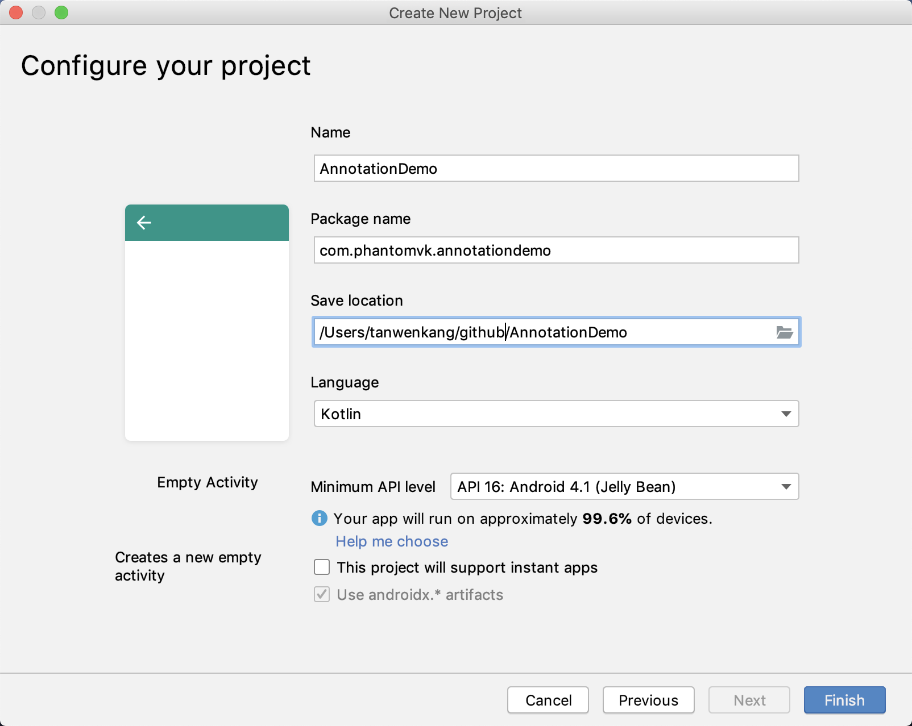
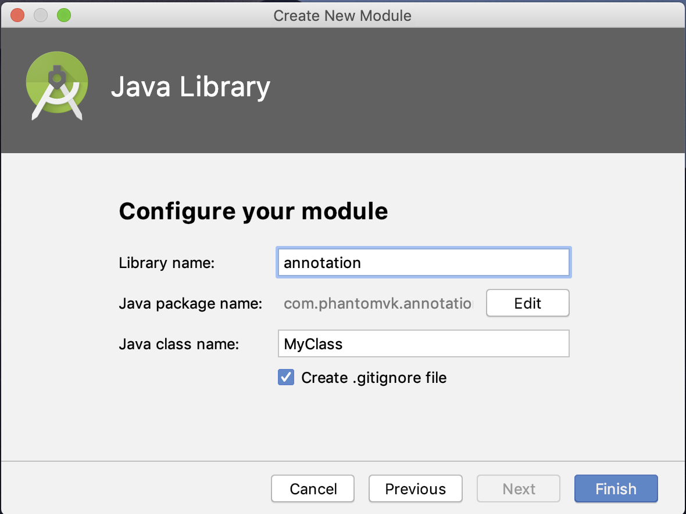
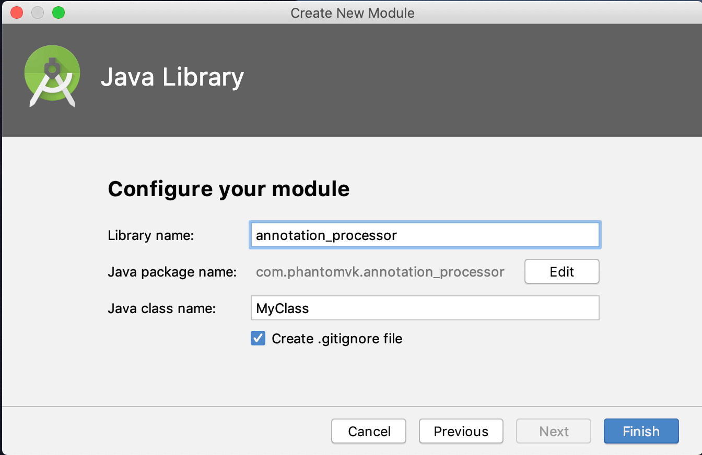
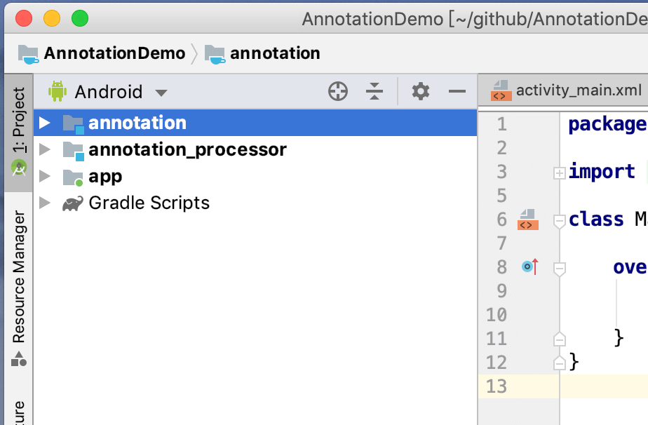
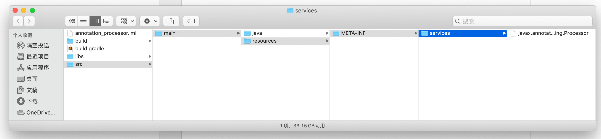
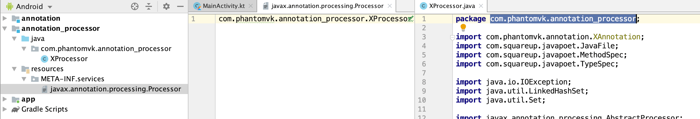
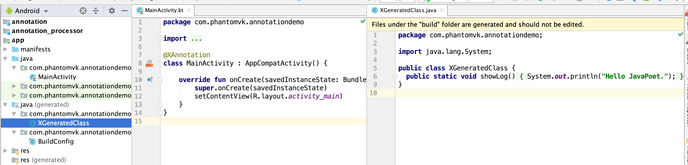

新建名为 __annotation__ 的模块，里面存放所有注解类，这里名为 __XAnnotation!__



```java
import java.lang.annotation.ElementType;
import java.lang.annotation.Retention;
import java.lang.annotation.RetentionPolicy;
import java.lang.annotation.Target;

@Target(ElementType.TYPE)
@Retention(RetentionPolicy.RUNTIME)
public @interface XAnnotation {
}
```

然后新建另外一个模块 __annotation_processor__ 用于存放注解处理器。存放注解处理器的模块必须和注解类模块分离，不然上层模块依赖后会出现问题。



创建之后模块布局就是这个结果



同时模块里添加 __javapoet__ 或 __kotlinpoet__ 依赖，推荐使用 __javapoet__。还要导入上述创建的 __annotation__，这样注解处理器就能识别我们创建的注解类。


```groovy
apply plugin: 'java-library'

dependencies {
    implementation fileTree(dir: 'libs', include: ['*.jar'])
    implementation 'com.squareup:javapoet:1.11.1'
    implementation project(":annotation")
}

sourceCompatibility = "8"
targetCompatibility = "8"
```

 __javapoet__ 或 __kotlinpoet__ 的功能是通过代码编写，在编译前用预设代码拼接出新的类。根据名字就知道他们分别能生成java代码和kotlin代码。

创建注解处理器

```java
@SupportedSourceVersion(SourceVersion.RELEASE_8)
@SupportedAnnotationTypes({"com.phantomvk.annotation.XAnnotation"})
public class XProcessor extends AbstractProcessor {

    private Filer mFiler;
    private Messager mMessager;
    private Elements mElementUtils;

    @Override
    public synchronized void init(ProcessingEnvironment processingEnvironment) {
        super.init(processingEnvironment);
        mFiler = processingEnvironment.getFiler();
        mMessager = processingEnvironment.getMessager();
        mElementUtils = processingEnvironment.getElementUtils();
    }

    @Override
    public Set<String> getSupportedAnnotationTypes() {
        Set<String> types = new LinkedHashSet<>();
        types.add(XAnnotation.class.getCanonicalName());
        return types;
    }

    @Override
    public SourceVersion getSupportedSourceVersion() {
        return SourceVersion.RELEASE_8;
    }

    @Override
    public boolean process(Set<? extends TypeElement> set, RoundEnvironment roundEnvironment) {
        return false;
    }
}
```

继续完善 __process()__ 的逻辑。

```java
@Override
public boolean process(Set<? extends TypeElement> set, RoundEnvironment roundEnvironment) {
    Set<? extends Element> elements = roundEnvironment.getElementsAnnotatedWith(XAnnotation.class);

    for (Element element : elements) {
        PackageElement packageElement = mElementUtils.getPackageOf(element);
        String packageName = packageElement.getQualifiedName().toString();

        MethodSpec methodSpec = MethodSpec.methodBuilder("showLog")
                .addModifiers(Modifier.PUBLIC, Modifier.STATIC)
                .returns(void.class)
                .addStatement("$T.out.println($S)", System.class, "Hello JavaPoet.")
                .build();

        TypeSpec typeSpec = TypeSpec.classBuilder("XGeneratedClass")
                .addModifiers(Modifier.PUBLIC)
                .addMethod(methodSpec)
                .build();

        JavaFile javaFile = JavaFile.builder(packageName, typeSpec)
                .build();

        try {
            javaFile.writeTo(mFiler);
        } catch (IOException e) {
            e.printStackTrace();
        }
    }

    return true;
}
```

注册注解处理器



```
javax.annotation.processing.Processor
```



#### App导入

```groovy
apply plugin: 'kotlin-kapt'

// JavaPoet required Java8
android {
    compileOptions {
        sourceCompatibility 1.8
        targetCompatibility 1.8
    }
}

dependencies {
    implementation project(":annotation")
    kapt project(":annotation_processor") // annotationProcessor for Java
}
```

导入之后就可以用生命的注解类修饰 __MainActivity__

```kotlin
@XAnnotation
class MainActivity : AppCompatActivity() {

    override fun onCreate(savedInstanceState: Bundle?) {
        super.onCreate(savedInstanceState)
        setContentView(R.layout.activity_main)
    }
}
```

代码生成之后



项目就能直接引用生成类

```kotlin
@XAnnotation
class MainActivity : AppCompatActivity() {

    override fun onCreate(savedInstanceState: Bundle?) {
        super.onCreate(savedInstanceState)
        setContentView(R.layout.activity_main)
        XGeneratedClass.showLog() // 直接引用
    }
}
```
